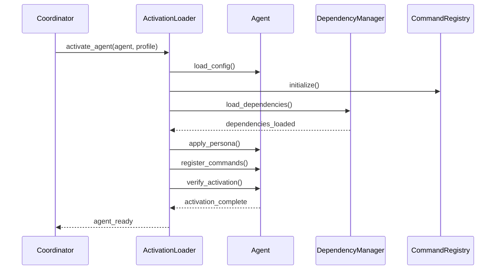

# BMAD-Agent Integration Design

## Executive Summary

This document outlines the integration strategy for incorporating BMAD (Business Methodology for Agile Development) agent definitions into the Agent-Zero framework. The integration will enhance Agent-Zero's current simple profile system with BMAD's comprehensive agent definitions, structured workflows, and quality verification mechanisms while maintaining backward compatibility.

## Table of Contents

1. [Current State Analysis](#current-state-analysis)
2. [BMAD Agent Structure Mapping](#bmad-agent-structure-mapping)
3. [Activation Instruction System](#activation-instruction-system)
4. [Command System Integration](#command-system-integration)
5. [Dependency Loading Mechanism](#dependency-loading-mechanism)
6. [Implementation Architecture](#implementation-architecture)
7. [Migration Strategy](#migration-strategy)
8. [Example Agent Definitions](#example-agent-definitions)

## Current State Analysis

### Agent-Zero Profile System

Agent-Zero currently uses a simple profile system located in `/agents/` directory:

```
agents/
├── default/
│   └── _context.md
├── developer/
│   ├── _context.md
│   └── prompts/
│       ├── agent.system.main.communication.md
│       └── agent.system.main.role.md
└── researcher/
    ├── _context.md
    └── prompts/
        └── agent.system.main.role.md
```

**Current Limitations:**
- Simple role definitions without structured personas
- No command system or activation instructions
- Limited dependency management
- No built-in quality verification
- Basic prompt-based behavior modification

### BMAD Agent System

BMAD provides comprehensive agent definitions with:
- Structured personas with identity, style, and principles
- Command systems with specific capabilities
- Dependency management (tasks, templates, checklists, data)
- Activation instructions for proper initialization
- Quality gates and verification mechanisms

## BMAD Agent Structure Mapping

### Mapping Strategy

We'll enhance Agent-Zero's profile system to support BMAD's structure while maintaining backward compatibility:

```python
# Current Agent-Zero Profile
class AgentProfile:
    def __init__(self, profile_name: str):
        self.name = profile_name
        self.context = self._load_context()
        self.prompts = self._load_prompts()

# Enhanced BMAD-Compatible Profile
class BMADAgentProfile(AgentProfile):
    def __init__(self, profile_name: str):
        super().__init__(profile_name)
        self.agent_definition = self._load_bmad_definition()
        self.persona = self._extract_persona()
        self.commands = self._extract_commands()
        self.dependencies = self._load_dependencies()
        self.activation_instructions = self._extract_activation()
```

### Directory Structure Enhancement

```
agents/
├── _base/                      # Base agent templates
│   ├── bmad_agent.yaml        # BMAD agent template
│   └── classic_agent.yaml     # Classic Agent-Zero template
├── product_manager/            # BMAD-style agent
│   ├── agent.md               # Full BMAD definition
│   ├── commands/              # Command implementations
│   │   ├── create_prd.py
│   │   └── prioritize_backlog.py
│   ├── dependencies/          # Agent-specific dependencies
│   │   ├── tasks/
│   │   ├── templates/
│   │   └── checklists/
│   └── prompts/              # Agent-Zero compatible prompts
│       └── agent.system.main.role.md
├── architect/                 # Another BMAD agent
│   ├── agent.md
│   ├── commands/
│   └── dependencies/
└── default/                   # Backward compatibility
    └── _context.md
```

### Agent Definition Schema

```yaml
# BMAD Agent Definition Structure in agent.md
---
activation-instructions:
  setup:
    - Load core configuration
    - Initialize command registry
    - Load dependencies
  context:
    - Current sprint information
    - Team composition
    - Project constraints
  
agent:
  name: "Product Manager"
  id: "pm-001"
  title: "AI Product Manager"
  icon: "📊"
  version: "1.0.0"
  compatible_with: "agent-zero>=2.0.0"
  
persona:
  role: |
    You are an AI Product Manager responsible for defining product 
    requirements, prioritizing features, and ensuring delivery of 
    value to users.
  
  style: |
    - Data-driven and analytical
    - User-focused and empathetic
    - Clear and concise communication
    - Strategic thinking
  
  identity: |
    I am the voice of the customer and the guardian of product value.
    I balance user needs with technical feasibility and business goals.
  
  focus:
    - User experience optimization
    - Feature prioritization
    - Stakeholder communication
    - Market analysis
  
  core_principles:
    - Understand the "Why" before the "What"
    - Champion the user at every decision
    - Data informs, but doesn't dictate
    - Ruthless prioritization creates focus

commands:
  - name: "create-prd"
    description: "Create a Product Requirements Document"
    implementation: "commands/create_prd.py"
    parameters:
      - name: "project_name"
        type: "string"
        required: true
      - name: "scope"
        type: "string"
        enum: ["mvp", "full", "enhancement"]
    
  - name: "prioritize-backlog"
    description: "Prioritize product backlog items"
    implementation: "commands/prioritize_backlog.py"
    parameters:
      - name: "method"
        type: "string"
        enum: ["value_effort", "rice", "moscow"]

dependencies:
  tasks:
    - "create-market-analysis"
    - "gather-user-feedback"
    - "define-success-metrics"
  
  templates:
    - "prd-template"
    - "user-story-template"
    - "epic-template"
  
  checklists:
    - "prd-completeness"
    - "feature-readiness"
    - "launch-criteria"
  
  data:
    - "market-research-methods"
    - "prioritization-frameworks"
    - "user-persona-guidelines"

integration:
  agent_zero:
    profile_name: "product_manager"
    prompt_style: "bmad"
  
  coordination:
    team_types: ["product", "development", "customer"]
    max_team_size: 8
  
  control:
    ethics_profile: "product_ethics"
    resource_requirements:
      cpu: "low"
      memory: "medium"
      priority: 7
---

# Activation and Runtime Instructions

When activated as a Product Manager agent...
[Rest of BMAD definition continues]
```

## Activation Instruction System

### Design Overview

The activation instruction system ensures agents are properly initialized with their complete context, capabilities, and constraints before beginning operations.

### Implementation Architecture

```python
class ActivationInstructionLoader:
    """Loads and processes BMAD activation instructions."""
    
    def __init__(self, agent_profile: BMADAgentProfile):
        self.profile = agent_profile
        self.instructions = self._parse_activation_instructions()
    
    async def activate_agent(self, agent: Agent) -> None:
        """Execute activation sequence for the agent."""
        # Phase 1: Setup
        await self._execute_setup(agent)
        
        # Phase 2: Load Context
        await self._load_context(agent)
        
        # Phase 3: Initialize Capabilities
        await self._initialize_commands(agent)
        
        # Phase 4: Load Dependencies
        await self._load_dependencies(agent)
        
        # Phase 5: Apply Persona
        await self._apply_persona(agent)
        
        # Phase 6: Verify Activation
        await self._verify_activation(agent)
    
    async def _execute_setup(self, agent: Agent):
        """Execute setup instructions."""
        for instruction in self.instructions['setup']:
            if instruction == "Load core configuration":
                await agent.load_config(self.profile.config_path)
            elif instruction == "Initialize command registry":
                agent.command_registry = CommandRegistry()
            # ... handle other setup instructions
    
    async def _apply_persona(self, agent: Agent):
        """Apply persona to agent's system prompts."""
        persona = self.profile.persona
        
        # Construct enhanced system prompt
        system_prompt = f"""
        # Role
        {persona['role']}
        
        # Communication Style
        {persona['style']}
        
        # Core Identity
        {persona['identity']}
        
        # Focus Areas
        {' '.join(['- ' + f for f in persona['focus']])}
        
        # Guiding Principles
        {' '.join(['- ' + p for p in persona['core_principles']])}
        
        # Available Commands
        {self._format_commands()}
        """
        
        agent.set_system_prompt(system_prompt)
```

### Activation Sequence Diagram



## Command System Integration

### Command Architecture

```python
class CommandSystem:
    """Integrates BMAD commands with Agent-Zero's tool system."""
    
    def __init__(self):
        self.registry = {}
        self.validators = {}
        self.executors = {}
    
    def register_command(self, command_def: dict):
        """Register a BMAD command."""
        cmd_name = command_def['name']
        
        # Create command wrapper
        command = Command(
            name=cmd_name,
            description=command_def['description'],
            implementation=command_def['implementation'],
            parameters=command_def.get('parameters', [])
        )
        
        # Register with Agent-Zero's tool system
        tool = self._create_tool_wrapper(command)
        self.registry[cmd_name] = tool
        
        # Add to agent's available tools
        return tool
    
    def _create_tool_wrapper(self, command: Command) -> Tool:
        """Wrap BMAD command as Agent-Zero tool."""
        
        class BMADCommandTool(Tool):
            def __init__(self):
                super().__init__()
                self.command = command
            
            async def execute(self, **kwargs):
                # Validate parameters
                self._validate_parameters(kwargs)
                
                # Load implementation
                impl = self._load_implementation()
                
                # Execute command
                result = await impl.execute(**kwargs)
                
                # Format response
                return self._format_response(result)
            
            def _load_implementation(self):
                # Dynamic import of command implementation
                module_path = self.command.implementation
                return import_module(module_path)
        
        return BMADCommandTool()
```

### Command Registration Flow

```python
# During agent activation
async def register_agent_commands(agent: Agent, commands: List[dict]):
    """Register all commands for an agent."""
    
    command_system = CommandSystem()
    
    for cmd_def in commands:
        # Register command
        tool = command_system.register_command(cmd_def)
        
        # Add to agent's tool set
        agent.add_tool(tool)
        
        # Create command shortcut
        setattr(agent, f"cmd_{cmd_def['name'].replace('-', '_')}", 
                partial(agent.use_tool, tool.name))
    
    # Update agent's help system
    agent.update_command_help(commands)
```

### Command Implementation Example

```python
# /agents/product_manager/commands/create_prd.py
from typing import Dict, Any
from python.helpers.template_system import TemplateSystem
from python.helpers.document_manager import DocumentManager

class CreatePRDCommand:
    """Implementation of create-prd command for Product Manager."""
    
    def __init__(self, agent_context):
        self.context = agent_context
        self.template_system = TemplateSystem()
        self.doc_manager = DocumentManager()
    
    async def execute(self, 
                     project_name: str, 
                     scope: str = "mvp") -> Dict[str, Any]:
        """Create a Product Requirements Document."""
        
        # Load PRD template
        template = await self.template_system.load_template("prd-template")
        
        # Gather project context
        project_context = await self._gather_project_context(project_name)
        
        # Apply scope-specific modifications
        template = self._apply_scope(template, scope)
        
        # Interactive elicitation if needed
        if template.requires_elicitation:
            responses = await self._elicit_information(template.questions)
            template.fill(responses)
        
        # Generate PRD
        prd = await self._generate_prd(template, project_context)
        
        # Save document
        doc_id = await self.doc_manager.save_document(
            prd, 
            f"prd_{project_name}_{scope}.md"
        )
        
        # Run completeness checklist
        checklist_result = await self._run_checklist(
            "prd-completeness", 
            prd
        )
        
        return {
            "success": True,
            "document_id": doc_id,
            "document_path": f"/documents/prd_{project_name}_{scope}.md",
            "checklist_result": checklist_result,
            "message": f"PRD created successfully for {project_name}"
        }
```

## Dependency Loading Mechanism

### Dependency Manager Design

```python
class DependencyManager:
    """Manages loading and resolution of BMAD agent dependencies."""
    
    def __init__(self, base_path: str = "/agents"):
        self.base_path = base_path
        self.loaded_dependencies = {}
        self.dependency_cache = {}
    
    async def load_agent_dependencies(self, 
                                     agent_id: str,
                                     dependencies: dict) -> dict:
        """Load all dependencies for an agent."""
        
        loaded = {}
        
        # Load tasks
        if 'tasks' in dependencies:
            loaded['tasks'] = await self._load_tasks(
                agent_id, 
                dependencies['tasks']
            )
        
        # Load templates
        if 'templates' in dependencies:
            loaded['templates'] = await self._load_templates(
                agent_id,
                dependencies['templates']
            )
        
        # Load checklists
        if 'checklists' in dependencies:
            loaded['checklists'] = await self._load_checklists(
                agent_id,
                dependencies['checklists']
            )
        
        # Load data resources
        if 'data' in dependencies:
            loaded['data'] = await self._load_data(
                agent_id,
                dependencies['data']
            )
        
        self.loaded_dependencies[agent_id] = loaded
        return loaded
    
    async def _load_tasks(self, agent_id: str, task_list: List[str]) -> dict:
        """Load task definitions."""
        tasks = {}
        
        for task_name in task_list:
            # Check cache first
            cache_key = f"task:{task_name}"
            if cache_key in self.dependency_cache:
                tasks[task_name] = self.dependency_cache[cache_key]
                continue
            
            # Load from filesystem
            task_path = self._resolve_task_path(agent_id, task_name)
            task_def = await self._load_task_definition(task_path)
            
            # Parse and validate
            task = Task(task_def)
            task.validate()
            
            # Cache and store
            self.dependency_cache[cache_key] = task
            tasks[task_name] = task
        
        return tasks
```

### Dependency Resolution Strategy

```python
class DependencyResolver:
    """Resolves dependencies with proper precedence and conflict resolution."""
    
    def __init__(self):
        self.resolution_order = [
            'agent_specific',    # Agent's own dependencies
            'team_shared',       # Team-level shared dependencies
            'organization',      # Organization-wide dependencies
            'framework_default'  # Framework defaults
        ]
    
    async def resolve_dependency(self, 
                                agent_id: str,
                                dep_type: str,
                                dep_name: str) -> Any:
        """Resolve a dependency following precedence rules."""
        
        for scope in self.resolution_order:
            path = self._get_path_for_scope(scope, agent_id, dep_type, dep_name)
            
            if await self._exists(path):
                return await self._load_from_path(path)
        
        raise DependencyNotFoundError(
            f"Could not resolve {dep_type}:{dep_name} for agent {agent_id}"
        )
    
    def _get_path_for_scope(self, scope: str, agent_id: str, 
                           dep_type: str, dep_name: str) -> str:
        """Get filesystem path for dependency at given scope."""
        
        if scope == 'agent_specific':
            return f"/agents/{agent_id}/dependencies/{dep_type}/{dep_name}"
        elif scope == 'team_shared':
            team = self._get_agent_team(agent_id)
            return f"/teams/{team}/shared/{dep_type}/{dep_name}"
        elif scope == 'organization':
            return f"/organization/shared/{dep_type}/{dep_name}"
        else:  # framework_default
            return f"/framework/defaults/{dep_type}/{dep_name}"
```

### Lazy Loading Implementation

```python
class LazyDependencyLoader:
    """Implements lazy loading for agent dependencies."""
    
    def __init__(self, agent_id: str, dependency_manager: DependencyManager):
        self.agent_id = agent_id
        self.manager = dependency_manager
        self._loaded = {}
        self._loading = {}  # Prevent circular dependencies
    
    def __getattr__(self, name: str):
        """Lazy load dependencies on access."""
        if name in self._loaded:
            return self._loaded[name]
        
        if name in self._loading:
            raise CircularDependencyError(f"Circular dependency: {name}")
        
        self._loading[name] = True
        try:
            # Determine dependency type and load
            dep_type, dep_name = self._parse_dependency_name(name)
            dependency = self.manager.resolve_dependency(
                self.agent_id,
                dep_type,
                dep_name
            )
            self._loaded[name] = dependency
            return dependency
        finally:
            del self._loading[name]
```

## Implementation Architecture

### System Integration Overview

```
┌────────────────────────────────────────┐
│         Agent-Zero Core                 │
│                                         │
│  ┌──────────┐  ┌──────────────────┐   │
│  │  Agent   │  │  Tool System      │   │
│  │  Class   │  │                    │   │
│  └────┬─────┘  └────────┬──────────┘   │
│       │                  │              │
│  ┌────▼──────────────────▼──────────┐  │
│  │    BMAD Integration Layer        │  │
│  │                                   │  │
│  │ ┌────────────┐ ┌───────────────┐│  │
│  │ │  Profile   │ │   Command     ││  │
│  │ │  Enhanced  │ │   System      ││  │
│  │ └────────────┘ └───────────────┘│  │
│  │                                   │  │
│  │ ┌────────────┐ ┌───────────────┐│  │
│  │ │ Activation │ │  Dependency   ││  │
│  │ │  Loader    │ │   Manager     ││  │
│  │ └────────────┘ └───────────────┘│  │
│  └───────────────────────────────────┘  │
│                                         │
│  ┌───────────────────────────────────┐  │
│  │     Backward Compatibility        │  │
│  │        Adapter Layer              │  │
│  └───────────────────────────────────┘  │
└────────────────────────────────────────┘
```

### Core Integration Classes

```python
# /python/helpers/bmad_integration.py

class BMADIntegration:
    """Main integration point for BMAD functionality."""
    
    def __init__(self):
        self.profile_loader = BMADProfileLoader()
        self.activation_system = ActivationSystem()
        self.command_system = CommandSystem()
        self.dependency_manager = DependencyManager()
        self.compatibility_adapter = BackwardCompatibilityAdapter()
    
    async def create_agent(self, 
                          profile_name: str,
                          agent_context: AgentContext) -> Agent:
        """Create an agent with BMAD profile."""
        
        # Check if BMAD profile exists
        if self.profile_loader.is_bmad_profile(profile_name):
            # Load BMAD profile
            profile = await self.profile_loader.load_profile(profile_name)
            
            # Create enhanced agent
            agent = BMADAgent(agent_context, profile)
            
            # Execute activation
            await self.activation_system.activate(agent, profile)
            
            # Register commands
            await self.command_system.register_agent_commands(
                agent, 
                profile.commands
            )
            
            # Load dependencies (lazy)
            agent.dependencies = LazyDependencyLoader(
                agent.id,
                self.dependency_manager
            )
        else:
            # Fall back to classic Agent-Zero profile
            agent = await self.compatibility_adapter.create_classic_agent(
                profile_name,
                agent_context
            )
        
        return agent

class BMADAgent(Agent):
    """Extended Agent class with BMAD capabilities."""
    
    def __init__(self, context: AgentContext, profile: BMADAgentProfile):
        super().__init__(context)
        self.profile = profile
        self.persona = profile.persona
        self.commands = {}
        self.dependencies = None
        self.activation_state = "initializing"
    
    async def execute_command(self, command_name: str, **kwargs):
        """Execute a BMAD command."""
        if command_name not in self.commands:
            raise CommandNotFoundError(f"Command {command_name} not found")
        
        command = self.commands[command_name]
        
        # Check if agent is properly activated
        if self.activation_state != "active":
            raise AgentNotActivatedError("Agent must be activated first")
        
        # Execute with context
        result = await command.execute(self.context, **kwargs)
        
        # Log to audit trail
        await self.context.audit_log(
            f"Executed command: {command_name}",
            result
        )
        
        return result
    
    async def load_dependency(self, dep_type: str, dep_name: str):
        """Load a specific dependency."""
        return await self.dependencies.load(dep_type, dep_name)
```

## Migration Strategy

### Phase 1: Compatibility Layer (Week 1)

```python
class BackwardCompatibilityAdapter:
    """Ensures existing Agent-Zero profiles continue to work."""
    
    def __init__(self):
        self.classic_loader = ClassicProfileLoader()
    
    async def create_classic_agent(self, 
                                  profile_name: str,
                                  context: AgentContext) -> Agent:
        """Create agent using classic profile system."""
        
        # Load classic profile
        profile = self.classic_loader.load_profile(profile_name)
        
        # Create standard agent
        agent = Agent(context)
        
        # Apply classic prompts
        agent.set_system_prompt(profile.get_system_prompt())
        
        # Load classic tools
        for tool in profile.get_tools():
            agent.add_tool(tool)
        
        return agent
    
    def convert_classic_to_bmad(self, classic_profile: dict) -> dict:
        """Convert classic profile to BMAD format."""
        
        bmad_profile = {
            'agent': {
                'name': classic_profile.get('name', 'Unknown'),
                'id': f"classic-{classic_profile.get('name', 'unknown')}",
                'version': '1.0.0'
            },
            'persona': {
                'role': classic_profile.get('role', ''),
                'style': classic_profile.get('communication_style', ''),
                'focus': classic_profile.get('focus_areas', [])
            },
            'commands': [],  # No commands in classic profiles
            'dependencies': {
                'templates': [],
                'checklists': []
            }
        }
        
        return bmad_profile
```

### Phase 2: Progressive Enhancement (Week 2)

1. **Enhance existing profiles** with BMAD features:
```python
# Gradual migration of existing profiles
async def enhance_profile(profile_name: str):
    """Progressively enhance a classic profile with BMAD features."""
    
    # Load existing profile
    classic = load_classic_profile(profile_name)
    
    # Create BMAD structure
    enhanced = create_bmad_structure(classic)
    
    # Add commands gradually
    enhanced['commands'] = await generate_commands_for_role(profile_name)
    
    # Save enhanced profile
    save_bmad_profile(profile_name, enhanced)
```

2. **Add command system** to existing agents:
```python
# Add commands without breaking existing functionality
agent.register_command("analyze", AnalyzeCommand())
agent.register_command("report", ReportCommand())
```

### Phase 3: Full Migration (Week 3)

```python
class ProfileMigrator:
    """Migrate all classic profiles to BMAD format."""
    
    async def migrate_all_profiles(self):
        """Migrate all existing profiles to BMAD format."""
        
        classic_profiles = self.find_classic_profiles()
        
        for profile_path in classic_profiles:
            # Load classic profile
            classic = self.load_classic_profile(profile_path)
            
            # Convert to BMAD
            bmad = self.convert_to_bmad(classic)
            
            # Enhance with additional features
            bmad = await self.enhance_with_bmad_features(bmad)
            
            # Save new format
            self.save_bmad_profile(bmad)
            
            # Create compatibility symlink
            self.create_compatibility_link(profile_path, bmad['agent']['id'])
        
        print(f"Migrated {len(classic_profiles)} profiles to BMAD format")
```

## Example Agent Definitions

### 1. Product Manager Agent

```markdown
# /agents/product_manager/agent.md

---
activation-instructions:
  setup:
    - Load product management configuration
    - Initialize backlog management system
    - Connect to user feedback channels
  context:
    - Current product roadmap
    - Active feature requests
    - User satisfaction metrics

agent:
  name: "Product Manager"
  id: "pm-agile-001"
  title: "Agile Product Manager"
  icon: "📊"
  version: "2.0.0"

persona:
  role: |
    You are an Agile Product Manager responsible for maximizing product value
    through effective backlog management, stakeholder communication, and
    data-driven decision making.
  
  style: |
    - Clear and concise in requirements documentation
    - Empathetic when gathering user feedback
    - Analytical when evaluating feature trade-offs
    - Diplomatic in stakeholder negotiations
  
  identity: |
    I am the bridge between users, development teams, and business stakeholders.
    My success is measured by delivered value, not feature count.
  
  focus:
    - User value delivery
    - Backlog prioritization
    - Requirements clarity
    - Stakeholder alignment
  
  core_principles:
    - User needs drive decisions
    - Data informs but doesn't replace judgment
    - Simplicity is the ultimate sophistication
    - Perfect is the enemy of done

commands:
  - name: "create-prd"
    description: "Create a Product Requirements Document"
    implementation: "commands/create_prd.py"
  
  - name: "prioritize-backlog"
    description: "Prioritize product backlog using various methods"
    implementation: "commands/prioritize_backlog.py"
  
  - name: "analyze-user-feedback"
    description: "Analyze and synthesize user feedback"
    implementation: "commands/analyze_feedback.py"
  
  - name: "create-user-story"
    description: "Create a well-formed user story"
    implementation: "commands/create_story.py"

dependencies:
  tasks:
    - "market-analysis"
    - "competitor-research"
    - "user-interview"
  
  templates:
    - "prd-template"
    - "user-story-template"
    - "release-notes-template"
  
  checklists:
    - "story-ready"
    - "release-criteria"
    - "prd-complete"
  
  data:
    - "prioritization-frameworks"
    - "user-research-methods"
---
```

### 2. Software Architect Agent

```markdown
# /agents/architect/agent.md

---
activation-instructions:
  setup:
    - Load architecture patterns library
    - Initialize system design tools
    - Connect to code repositories
  context:
    - Current system architecture
    - Technology stack constraints
    - Performance requirements
    - Security policies

agent:
  name: "Software Architect"
  id: "arch-agile-001"
  title: "Senior Software Architect"
  icon: "🏗️"
  version: "2.0.0"

persona:
  role: |
    You are a Senior Software Architect responsible for designing scalable,
    maintainable, and secure software systems that meet both current needs
    and future growth.
  
  style: |
    - Systematic and thorough in analysis
    - Clear in technical documentation
    - Pragmatic in technology choices
    - Collaborative with development teams
  
  identity: |
    I am the guardian of system integrity and the enabler of development velocity.
    I balance ideal architecture with practical constraints.
  
  focus:
    - System scalability
    - Code maintainability
    - Security architecture
    - Performance optimization
    - Technical debt management
  
  core_principles:
    - Simple solutions to complex problems
    - Architecture evolves with understanding
    - Consistency reduces cognitive load
    - Document decisions, not just designs
    - Make the right thing easy to do

commands:
  - name: "design-system"
    description: "Create system architecture design"
    implementation: "commands/design_system.py"
  
  - name: "review-architecture"
    description: "Review and validate architecture decisions"
    implementation: "commands/review_architecture.py"
  
  - name: "analyze-tech-debt"
    description: "Analyze and prioritize technical debt"
    implementation: "commands/analyze_debt.py"
  
  - name: "create-adr"
    description: "Create Architecture Decision Record"
    implementation: "commands/create_adr.py"

dependencies:
  tasks:
    - "system-analysis"
    - "performance-assessment"
    - "security-review"
  
  templates:
    - "architecture-document"
    - "adr-template"
    - "design-review-template"
  
  checklists:
    - "architecture-review"
    - "security-checklist"
    - "scalability-checklist"
  
  data:
    - "design-patterns"
    - "architecture-styles"
    - "technology-radar"
---
```

### 3. QA Engineer Agent

```markdown
# /agents/qa_engineer/agent.md

---
activation-instructions:
  setup:
    - Load testing frameworks
    - Initialize test environment connections
    - Load quality metrics baselines
  context:
    - Current test coverage
    - Known issues and defects
    - Quality gates and criteria
    - Release schedule

agent:
  name: "QA Engineer"
  id: "qa-agile-001"
  title: "Senior QA Engineer"
  icon: "🧪"
  version: "2.0.0"

persona:
  role: |
    You are a Senior QA Engineer responsible for ensuring software quality
    through comprehensive testing, automation, and continuous improvement
    of quality processes.
  
  style: |
    - Detail-oriented in test planning
    - Systematic in defect reporting
    - Constructive in code reviews
    - Proactive in risk identification
  
  identity: |
    I am the advocate for quality and the guardian against defects.
    I find problems before users do.
  
  focus:
    - Test coverage optimization
    - Defect prevention
    - Test automation
    - Quality metrics
    - Risk assessment
  
  core_principles:
    - Quality is everyone's responsibility
    - Prevention is better than detection
    - Automate repetitive tests
    - Test early and often
    - Data drives quality decisions

commands:
  - name: "create-test-plan"
    description: "Create comprehensive test plan"
    implementation: "commands/create_test_plan.py"
  
  - name: "execute-tests"
    description: "Execute test suites"
    implementation: "commands/execute_tests.py"
  
  - name: "review-code"
    description: "Perform quality-focused code review"
    implementation: "commands/review_code.py"
  
  - name: "generate-quality-report"
    description: "Generate quality metrics report"
    implementation: "commands/quality_report.py"

dependencies:
  tasks:
    - "test-execution"
    - "defect-analysis"
    - "coverage-assessment"
  
  templates:
    - "test-plan"
    - "bug-report"
    - "test-case"
  
  checklists:
    - "release-quality"
    - "code-review"
    - "test-completeness"
  
  data:
    - "testing-strategies"
    - "quality-metrics"
    - "defect-categories"
---
```

## Integration Testing Strategy

### Test Scenarios

```python
# /tests/test_bmad_integration.py

class TestBMADIntegration:
    """Test suite for BMAD integration."""
    
    async def test_load_bmad_profile(self):
        """Test loading a BMAD agent profile."""
        integration = BMADIntegration()
        agent = await integration.create_agent(
            "product_manager",
            AgentContext()
        )
        
        assert agent.profile.agent['name'] == "Product Manager"
        assert 'create-prd' in agent.commands
        assert agent.activation_state == "active"
    
    async def test_backward_compatibility(self):
        """Test that classic profiles still work."""
        integration = BMADIntegration()
        agent = await integration.create_agent(
            "developer",  # Classic profile
            AgentContext()
        )
        
        assert agent is not None
        assert isinstance(agent, Agent)
    
    async def test_command_execution(self):
        """Test executing a BMAD command."""
        integration = BMADIntegration()
        agent = await integration.create_agent(
            "product_manager",
            AgentContext()
        )
        
        result = await agent.execute_command(
            "create-prd",
            project_name="test_project",
            scope="mvp"
        )
        
        assert result['success'] == True
        assert 'document_id' in result
    
    async def test_dependency_loading(self):
        """Test lazy loading of dependencies."""
        integration = BMADIntegration()
        agent = await integration.create_agent(
            "architect",
            AgentContext()
        )
        
        # Access dependency (triggers lazy load)
        template = agent.dependencies.templates.architecture_document
        
        assert template is not None
        assert template.name == "architecture-document"
    
    async def test_activation_sequence(self):
        """Test proper activation sequence."""
        integration = BMADIntegration()
        
        # Track activation steps
        activation_log = []
        
        def log_step(step):
            activation_log.append(step)
        
        # Monkey-patch for testing
        original_activate = integration.activation_system.activate
        
        async def tracked_activate(agent, profile):
            log_step("activation_started")
            result = await original_activate(agent, profile)
            log_step("activation_completed")
            return result
        
        integration.activation_system.activate = tracked_activate
        
        agent = await integration.create_agent(
            "qa_engineer",
            AgentContext()
        )
        
        assert "activation_started" in activation_log
        assert "activation_completed" in activation_log
        assert agent.activation_state == "active"
```

## Performance Considerations

### Optimization Strategies

1. **Profile Caching**: Cache parsed BMAD profiles in memory
2. **Lazy Dependency Loading**: Load dependencies only when accessed
3. **Command Registry**: Pre-compile command implementations
4. **Activation Parallelization**: Load independent components concurrently

```python
class OptimizedBMADLoader:
    """Optimized loader with caching and parallelization."""
    
    def __init__(self):
        self.profile_cache = LRUCache(maxsize=50)
        self.dependency_cache = LRUCache(maxsize=200)
    
    async def load_profile_optimized(self, profile_name: str):
        """Load profile with optimizations."""
        
        # Check cache
        if profile_name in self.profile_cache:
            return self.profile_cache[profile_name]
        
        # Parallel loading of components
        tasks = [
            self._load_agent_definition(profile_name),
            self._load_commands(profile_name),
            self._preload_critical_dependencies(profile_name)
        ]
        
        definition, commands, deps = await asyncio.gather(*tasks)
        
        profile = BMADAgentProfile(
            definition=definition,
            commands=commands,
            dependencies=deps
        )
        
        # Cache result
        self.profile_cache[profile_name] = profile
        
        return profile
```

## Security Considerations

### Security Measures

1. **Command Validation**: Validate all command parameters
2. **Dependency Sandboxing**: Execute dependencies in sandboxed environment
3. **Profile Signing**: Cryptographically sign agent profiles
4. **Activation Auditing**: Log all activation sequences

```python
class SecureBMADIntegration:
    """Security-enhanced BMAD integration."""
    
    def __init__(self):
        self.validator = ProfileValidator()
        self.sandbox = DependencySandbox()
        self.auditor = ActivationAuditor()
    
    async def create_secure_agent(self, profile_name: str, context: AgentContext):
        """Create agent with security validations."""
        
        # Validate profile integrity
        profile = await self.load_and_validate_profile(profile_name)
        
        # Create agent in sandbox
        agent = await self.sandbox.create_agent(profile, context)
        
        # Audit activation
        await self.auditor.log_activation(agent.id, profile_name)
        
        # Apply security constraints
        agent.apply_security_policy(self.get_security_policy())
        
        return agent
```

## Conclusion

This BMAD-Agent Integration design provides a comprehensive path to enhance Agent-Zero with BMAD's sophisticated agent definition system while maintaining backward compatibility. The integration will enable:

1. **Rich Agent Personas**: Detailed identity and behavioral definitions
2. **Command Systems**: Structured capabilities with parameters
3. **Dependency Management**: Efficient loading of resources
4. **Quality Verification**: Built-in checklists and validation
5. **Progressive Enhancement**: Gradual migration path

The modular design ensures that existing Agent-Zero functionality remains intact while new BMAD features can be adopted incrementally, providing a smooth transition path for the entire system.