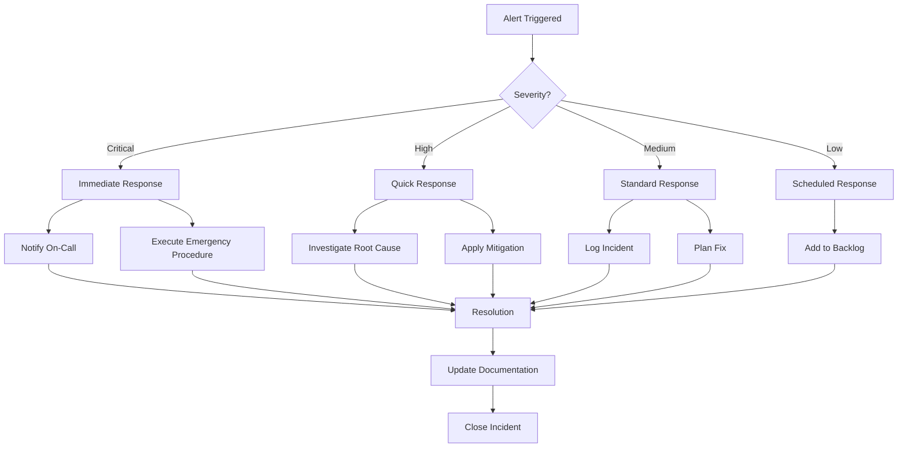
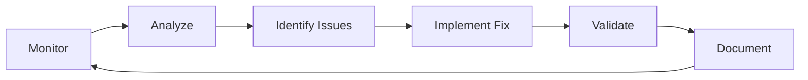

# ZAZA UAT Monitoring & Validation Procedures
## Comprehensive Monitoring Guide for Digital Marketing Agency Operations

---

## 1. Monitoring Architecture

### Overview
```
┌─────────────────────────────────────────────┐
│           ZAZA Monitoring Stack             │
├─────────────────────────────────────────────┤
│                                             │
│  ┌──────────────┐      ┌──────────────┐   │
│  │  Prometheus  │◄─────│   Grafana    │   │
│  │   (Metrics)  │      │ (Dashboards) │   │
│  └──────────────┘      └──────────────┘   │
│         ▲                      ▲           │
│         │                      │           │
│  ┌──────┴──────┬───────────────┤           │
│  │             │               │           │
│  ▼             ▼               ▼           │
│ Control    Coordination    Execution       │
│  Layer        Layer          Teams         │
└─────────────────────────────────────────────┘
```

### Components
- **Prometheus**: Time-series metrics collection
- **Grafana**: Visualization and alerting
- **Loki**: Log aggregation (optional)
- **Custom Exporters**: Application-specific metrics

---

## 2. Key Performance Indicators (KPIs)

### System Health KPIs
| Metric | Target | Warning | Critical |
|--------|--------|---------|----------|
| System Uptime | > 99.9% | < 99.9% | < 99% |
| API Response Time | < 200ms | > 500ms | > 1000ms |
| Error Rate | < 1% | > 2% | > 5% |
| Container Health | 100% | < 95% | < 90% |

### Business KPIs
| Metric | Target | Warning | Critical |
|--------|--------|---------|----------|
| Workflow Completion Rate | > 95% | < 90% | < 80% |
| Content Quality Score | > 85% | < 80% | < 70% |
| Team Utilization | 60-80% | < 50% or > 85% | < 40% or > 90% |
| Client Onboarding Time | < 2 hours | > 3 hours | > 4 hours |
| Sprint Velocity Variance | < 20% | > 30% | > 40% |

### Resource KPIs
| Metric | Target | Warning | Critical |
|--------|--------|---------|----------|
| CPU Usage | < 60% | > 70% | > 85% |
| Memory Usage | < 70% | > 80% | > 90% |
| Disk I/O | < 60% | > 75% | > 90% |
| Network Latency | < 10ms | > 50ms | > 100ms |

---

## 3. Monitoring Dashboards

### Dashboard 1: Executive Overview
**Purpose**: High-level business and system health  
**Update Frequency**: Real-time  
**Key Widgets**:
- System health status (traffic light)
- Active clients count
- Running workflows
- Team utilization chart
- Revenue tracking (simulated)
- Quality metrics trend
- Alert summary

### Dashboard 2: Team Performance
**Purpose**: Monitor AI team effectiveness  
**Update Frequency**: 5 minutes  
**Key Widgets**:
- Team status grid
- Task completion rates by team
- Communication flow diagram
- Agent response times
- Learning metrics
- Collaboration efficiency

### Dashboard 3: Technical Operations
**Purpose**: System and infrastructure monitoring  
**Update Frequency**: 1 minute  
**Key Widgets**:
- Container status
- Resource usage (CPU, Memory, Disk, Network)
- API endpoint health
- Database performance
- Queue depths
- Error logs stream

### Dashboard 4: Workflow Analytics
**Purpose**: Track workflow execution and efficiency  
**Update Frequency**: 5 minutes  
**Key Widgets**:
- Active workflows
- Workflow duration histogram
- Success/failure rates
- Bottleneck identification
- Document flow tracking
- Quality gate status

### Dashboard 5: Security & Compliance
**Purpose**: Monitor ethics and safety systems  
**Update Frequency**: Real-time  
**Key Widgets**:
- Ethics violations
- Safety threshold status
- Resource limit enforcement
- Audit trail activity
- Emergency intervention count
- Compliance score

---

## 4. Monitoring Procedures

### 4.1 Daily Monitoring Routine

#### Morning Check (9:00 AM)
```bash
#!/bin/bash
# morning_check.sh

echo "=== ZAZA Morning Health Check ==="
date

# Check system status
/opt/zaza/scripts/health_check.sh

# Review overnight alerts
grep "ALERT" /var/log/zaza/*.log | tail -20

# Check backup status
ls -la /backup/zaza/ | tail -5

# Resource utilization
docker stats --no-stream

echo "=== Morning Check Complete ==="
```

#### Afternoon Review (2:00 PM)
- Review Grafana dashboards
- Check workflow completion rates
- Monitor team performance metrics
- Verify quality scores

#### End of Day Summary (5:00 PM)
- Generate daily report
- Review any incidents
- Check next day's capacity
- Verify backup completion

### 4.2 Real-Time Monitoring

#### Critical Metrics to Watch
1. **API Health Endpoints**
   ```bash
   watch -n 10 'curl -s http://198.18.2.234:8000/health | jq .'
   ```

2. **Workflow Status**
   ```bash
   watch -n 30 'curl -s http://198.18.2.234:8001/api/workflows/active | jq .'
   ```

3. **Agent Communication**
   ```bash
   docker-compose -f docker-compose.zaza.yml logs -f --tail=50 | grep "MESSAGE"
   ```

4. **Resource Usage**
   ```bash
   watch -n 5 'docker stats --no-stream'
   ```

### 4.3 Alert Response Procedures

#### Alert Severity Levels

**CRITICAL (P1)** - Immediate Response Required
- System down
- Data corruption
- Security breach
- Ethics violation

**HIGH (P2)** - Response within 15 minutes
- Performance degradation > 50%
- Workflow failures > 20%
- Resource exhaustion imminent

**MEDIUM (P3)** - Response within 1 hour
- Single agent failure
- Quality degradation
- Backup failure

**LOW (P4)** - Response within 4 hours
- Minor performance issues
- Non-critical errors
- Learning anomalies

#### Alert Response Workflow


---

## 5. Validation Procedures

### 5.1 Functional Validation

#### Workflow Validation
```python
# validate_workflow.py
import requests
import json
import time

def validate_workflow(workflow_id):
    """Validate workflow execution meets criteria"""
    
    # Get workflow details
    response = requests.get(f"http://198.18.2.234:8001/api/workflows/{workflow_id}")
    workflow = response.json()
    
    validations = {
        "completed": workflow["status"] == "completed",
        "duration_ok": workflow["duration"] < 7200,  # 2 hours
        "all_steps_executed": len(workflow["completed_steps"]) == len(workflow["total_steps"]),
        "quality_gates_passed": all(gate["status"] == "PASS" for gate in workflow["quality_gates"]),
        "no_errors": len(workflow["errors"]) == 0
    }
    
    return all(validations.values()), validations

# Run validation
workflow_id = "test_workflow_001"
passed, results = validate_workflow(workflow_id)
print(f"Workflow Validation: {'PASSED' if passed else 'FAILED'}")
print(json.dumps(results, indent=2))
```

#### Content Quality Validation
```python
# validate_content.py
def validate_content_quality(content_id):
    """Validate content meets quality standards"""
    
    # Quality criteria
    criteria = {
        "readability_score": 70,  # Flesch Reading Ease
        "seo_score": 80,
        "grammar_score": 95,
        "originality_score": 90,
        "brand_alignment": 85
    }
    
    # Get content analysis
    response = requests.get(f"http://198.18.2.234:8001/api/content/{content_id}/quality")
    scores = response.json()
    
    validation_results = {}
    for metric, threshold in criteria.items():
        validation_results[metric] = {
            "score": scores.get(metric, 0),
            "threshold": threshold,
            "passed": scores.get(metric, 0) >= threshold
        }
    
    overall_passed = all(v["passed"] for v in validation_results.values())
    return overall_passed, validation_results
```

### 5.2 Performance Validation

#### Response Time Validation
```bash
#!/bin/bash
# validate_response_times.sh

echo "Testing API Response Times..."

# Test Control API
CONTROL_TIME=$(curl -o /dev/null -s -w "%{time_total}\n" http://198.18.2.234:8000/health)
echo "Control API: ${CONTROL_TIME}s"

# Test Coordination API
COORD_TIME=$(curl -o /dev/null -s -w "%{time_total}\n" http://198.18.2.234:8001/health)
echo "Coordination API: ${COORD_TIME}s"

# Validate against thresholds
if (( $(echo "$CONTROL_TIME < 0.5" | bc -l) )); then
    echo "✓ Control API response time OK"
else
    echo "✗ Control API response time FAILED"
fi

if (( $(echo "$COORD_TIME < 0.5" | bc -l) )); then
    echo "✓ Coordination API response time OK"
else
    echo "✗ Coordination API response time FAILED"
fi
```

#### Throughput Validation
```python
# validate_throughput.py
import concurrent.futures
import requests
import time

def test_throughput(num_requests=100):
    """Test system throughput"""
    
    def make_request(i):
        start = time.time()
        response = requests.get("http://198.18.2.234:8001/api/health")
        return time.time() - start, response.status_code == 200
    
    start_time = time.time()
    
    with concurrent.futures.ThreadPoolExecutor(max_workers=10) as executor:
        results = list(executor.map(make_request, range(num_requests)))
    
    total_time = time.time() - start_time
    successful = sum(1 for _, success in results if success)
    avg_response = sum(t for t, _ in results) / len(results)
    
    throughput = num_requests / total_time
    
    print(f"Throughput Test Results:")
    print(f"  Total Requests: {num_requests}")
    print(f"  Successful: {successful}")
    print(f"  Total Time: {total_time:.2f}s")
    print(f"  Throughput: {throughput:.2f} req/s")
    print(f"  Avg Response: {avg_response:.3f}s")
    
    # Validate against targets
    return throughput > 50  # Target: 50+ requests per second

# Run test
passed = test_throughput()
print(f"\nThroughput Validation: {'PASSED' if passed else 'FAILED'}")
```

### 5.3 Data Validation

#### Database Integrity Check
```sql
-- validate_database.sql
-- Run integrity checks on ZAZA database

-- Check for orphaned records
SELECT 'Orphaned Tasks' as check_name,
       COUNT(*) as count
FROM execution.tasks t
WHERE NOT EXISTS (
    SELECT 1 FROM coordination.teams tm
    WHERE t.agent_id = ANY(tm.members::text[])
);

-- Check for incomplete workflows
SELECT 'Incomplete Workflows' as check_name,
       COUNT(*) as count
FROM coordination.workflows
WHERE status = 'running'
  AND started_at < NOW() - INTERVAL '24 hours';

-- Check audit trail continuity
WITH audit_chain AS (
    SELECT id, hash, previous_hash,
           LAG(hash) OVER (ORDER BY id) as expected_previous
    FROM control.audit_log
)
SELECT 'Audit Chain Broken' as check_name,
       COUNT(*) as count
FROM audit_chain
WHERE previous_hash != expected_previous
  AND id > 1;

-- Check for data consistency
SELECT 'Data Consistency' as check_name,
       CASE 
           WHEN COUNT(*) = 0 THEN 'PASSED'
           ELSE 'FAILED: ' || COUNT(*) || ' issues'
       END as status
FROM (
    -- Add specific consistency checks here
    SELECT 1 WHERE false  -- Placeholder
) consistency_checks;
```

### 5.4 Security Validation

#### Ethics Engine Validation
```python
# validate_ethics.py
def test_ethics_engine():
    """Test ethics engine is blocking inappropriate requests"""
    
    test_cases = [
        {
            "description": "Misleading content request",
            "request": {
                "action": "create_content",
                "content": "Fake testimonials for product"
            },
            "expected": "blocked"
        },
        {
            "description": "Legitimate content request",
            "request": {
                "action": "create_content",
                "content": "Product features blog post"
            },
            "expected": "allowed"
        }
    ]
    
    results = []
    for test in test_cases:
        response = requests.post(
            "http://198.18.2.234:8000/api/ethics/validate",
            json=test["request"]
        )
        
        result = "blocked" if response.json().get("blocked") else "allowed"
        passed = result == test["expected"]
        
        results.append({
            "test": test["description"],
            "expected": test["expected"],
            "actual": result,
            "passed": passed
        })
    
    return all(r["passed"] for r in results), results
```

---

## 6. Validation Reporting

### Daily Validation Report Template
```markdown
# ZAZA UAT Daily Validation Report
**Date**: [YYYY-MM-DD]
**Environment**: 198.18.2.234

## System Health
- Uptime: [XX.X%]
- Availability: [XX.X%]
- Error Rate: [X.X%]

## Performance Metrics
- Avg Response Time: [XXXms]
- Throughput: [XX req/s]
- Resource Usage: CPU [XX%], Memory [XX%]

## Business Metrics
- Workflows Completed: [XX]
- Content Pieces Created: [XX]
- Quality Score: [XX%]
- Team Utilization: [XX%]

## Validation Results
| Check | Status | Details |
|-------|--------|---------|
| API Health | PASS/FAIL | [Details] |
| Workflow Execution | PASS/FAIL | [Details] |
| Content Quality | PASS/FAIL | [Details] |
| Database Integrity | PASS/FAIL | [Details] |
| Security Controls | PASS/FAIL | [Details] |

## Issues & Actions
1. [Issue description]
   - Impact: [Low/Medium/High]
   - Action: [Required action]
   - Owner: [Responsible party]

## Recommendations
- [Improvement suggestions based on monitoring]
```

---

## 7. Continuous Improvement

### Metrics Analysis
1. **Trend Analysis**: Weekly review of metric trends
2. **Anomaly Detection**: Automated alerts for deviations
3. **Capacity Planning**: Monthly capacity reviews
4. **Performance Optimization**: Identify and address bottlenecks

### Feedback Loop


---

## 8. Emergency Monitoring Procedures

### System Crisis Monitoring
When system is in crisis:
1. Enable verbose logging
2. Increase monitoring frequency to 10-second intervals
3. Open real-time dashboards
4. Start recording all metrics
5. Enable trace-level debugging

### Crisis Monitoring Commands
```bash
# Enable crisis monitoring mode
/opt/zaza/scripts/crisis_monitor.sh enable

# Stream all logs
docker-compose -f docker-compose.zaza.yml logs -f

# Continuous health checks
while true; do
    date
    /opt/zaza/scripts/health_check.sh
    sleep 10
done

# Record all metrics
prometheus_export --all --interval=10s --output=/backup/crisis_metrics/
```

---

*Monitoring & Validation Procedures Version: 1.0*
*Last Updated: 2025-08-22*
*For ZAZA Enterprises UAT Environment*